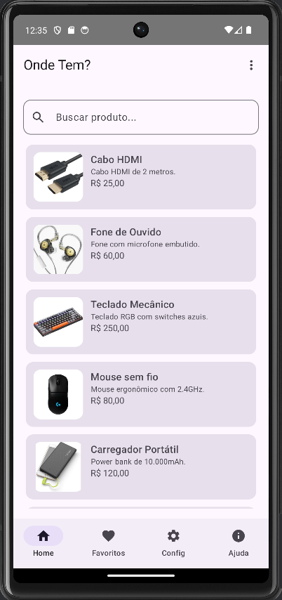
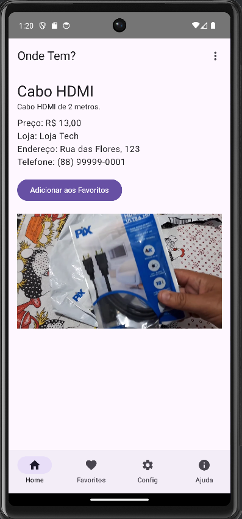
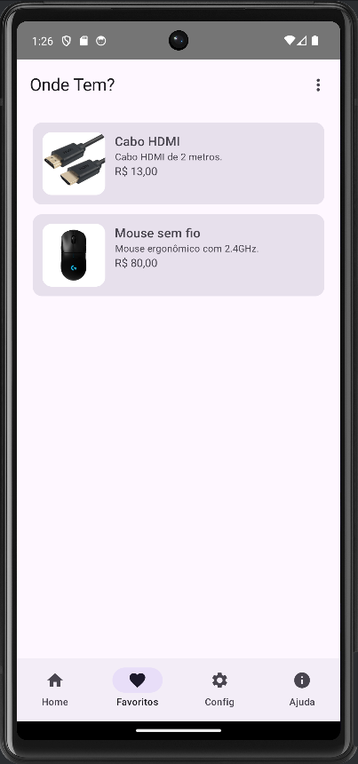
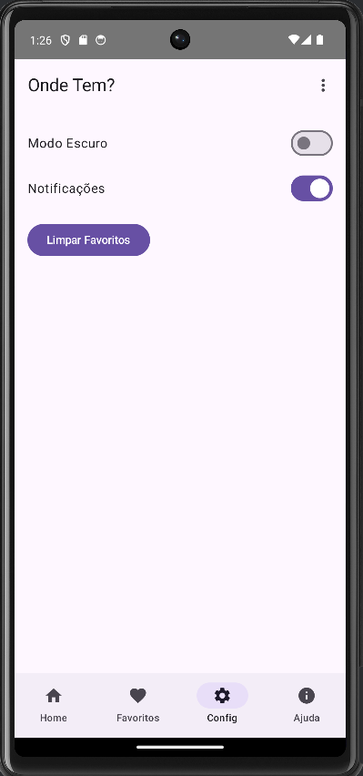
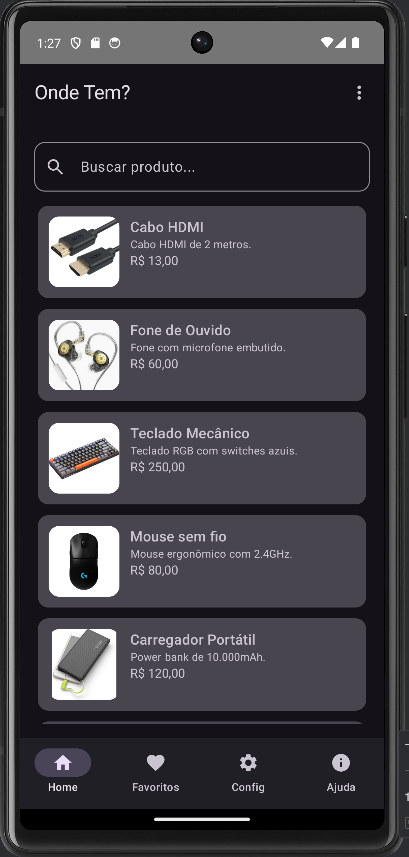

# Onde Tem?

## Universidade Federal do Ceará – Campus Quixadá

**Disciplina:** QXD0276 - Desenvolvimento de Software para Dispositivos Móveis

**Professor:** Francisco Victor da Silva Pinheiro

**Ano:** 2025

---

## 1. Integrantes

| Matrícula | Nome Completo | E-mail |
|-----------|----------------|--------|
| 509718 | JORGE BRUNO COSTA ALVES | jorge.bruno0921@alu.ufc.br |

---

## 2. Resumo da Entrega

Este projeto representa a terceira e mais avançada etapa do trabalho final da disciplina. A versão atual do *Onde Tem?* evoluiu de uma aplicação simples para uma solução mais robusta e interativa, construída com **Jetpack Compose** e **Kotlin**.

Nesta fase, o foco foi a implementação de funcionalidades avançadas exigidas para a conclusão do projeto, como:
- **Persistência de dados e preferências** com Jetpack DataStore.
- **Agendamento de notificações** utilizando Services e BroadcastReceivers.
- **Melhoria na experiência do usuário** com indicadores de progresso e animações sutis.
- **Criação de um fluxo de autenticação** para o perfil de "Vendedor", com telas de login e cadastro.

O aplicativo continua com o propósito de conectar consumidores a comerciantes locais, facilitando a busca por produtos em lojas físicas da região.

---

## 3. Repositório de Código e Vídeo

- 🎥 **[Vídeo de Apresentação](https://www.youtube.com/watch?v=8Fct9mTydCk):** (Seu link aqui)
- 📦 **[Download APK](https://github.com/brunoalves0921/mobile_projeto_final/tree/main/releases/download/v1.0.0/ondetem.apk):** (Seu link aqui)

---

## 4. Funcionalidades Implementadas

| Funcionalidade | Status | Responsável |
|---|---|---|
| **Interface e Navegação** | | |
| Tela inicial com busca de produtos | ✅ Concluído | Jorge Bruno |
| Tela de detalhes com informações e vídeo | ✅ Concluído | Jorge Bruno |
| Navegação com TopAppBar, BottomBar e NavController | ✅ Concluído | Jorge Bruno |
| Menu de opções (Configurações, Ajuda) | ✅ Concluído | Jorge Bruno |
| **Persistência de Dados (Jetpack DataStore)** | | |
| Salvar/Carregar preferência de Modo Escuro | ✅ Concluído | Jorge Bruno |
| Salvar/Carregar lista de produtos favoritos | ✅ Concluído | Jorge Bruno |
| Salvar/Carregar preferência de ativação de notificações | ✅ Concluído | Jorge Bruno |
| **Funcionalidades Avançadas** | | |
| Agendamento de notificações de lembrete para produtos | ✅ Concluído | Jorge Bruno |
| Indicador de progresso (`CircularProgressIndicator`) na busca | ✅ Concluído | Jorge Bruno |
| Animações de transição de tela (fade-in/out) | ✅ Concluído | Jorge Bruno |
| Animações em componentes (botão de favoritar) | ✅ Concluído | Jorge Bruno |
| **Autenticação de Vendedor** | | |
| Tela de seleção de perfil (Cliente/Vendedor) | ✅ Concluído | Jorge Bruno |
| Tela de Login para Vendedor | ✅ Concluído | Jorge Bruno |
| Tela de Cadastro para Vendedor | ✅ Concluído | Jorge Bruno |
| Persistência de dados do vendedor em arquivo JSON | ✅ Concluído | Jorge Bruno |
| **Ajuda e Configurações** | | |
| Tela de Configurações com controles funcionais | ✅ Concluído | Jorge Bruno |
| Tela de Ajuda com FAQ e formulário de contato | ✅ Concluído | Jorge Bruno |

---

## 5. Capturas de Tela

- 🏠 Tela Inicial
  
- 🔍 Busca com Indicador de Progresso
  *(Novo Print: Mostre a tela de busca com o indicador de progresso circular aparecendo)*
- 📄 Tela de Detalhes com vídeo
  
- ❤️ Tela de Favoritos (com itens salvos)
  
- ⚙️ Tela de Configurações funcional
  
- 🌙 Modo Escuro ativo
  
- 🔔 Notificação de Lembrete
  *(Novo Print: Mostre a notificação gerada pelo app na bandeja do sistema)*
- 👤 Tela de Seleção de Perfil
  *(Novo Print: Mostre a tela inicial onde o usuário escolhe entre "Sou Cliente" e "Sou Vendedor")*
- 🔑 Tela de Login do Vendedor
  *(Novo Print: Mostre a tela de login com os campos de e-mail e senha)*
- ✍️ Tela de Cadastro do Vendedor
  *(Novo Print: Mostre a tela de cadastro do vendedor)*

---

## 6. Arquitetura e Organização

O projeto segue o padrão **MVVM (Model-View-ViewModel)** e foi estruturado para separar responsabilidades, com as seguintes novidades:

```
com.example.ondetem/
│
├── data/
│ ├── SettingsDataStore.kt  // Novo: Gerencia as preferências com Jetpack DataStore
│ ├── VendedorRepository.kt // Novo: Gerencia os dados dos vendedores (leitura/escrita em JSON)
│ ├── Produto.kt
│ ├── Vendedor.kt
│ └── MockData.kt
│
├── notifications/
│ └── NotificationReceiver.kt // Novo: BroadcastReceiver para disparar as notificações agendadas
│
├── viewmodel/
│ └── ProdutoViewModel.kt   // Lógica de busca e estado da tela principal
│
├── ui/
│ ├── components/           // Componentes reutilizáveis (ProdutoCard, TopBar)
│ ├── screens/              // Telas do app (Home, Detalhes, Login, Cadastro, etc.)
│ └── MainScreen.kt         // Gerencia a navegação principal com NavHost
│
├── ui/theme/
│ └── Theme.kt              // Tema dinâmico claro/escuro com Material 3
│
└── MainActivity.kt         // Ponto de entrada, observa e provê o estado global (DataStore)
```

- **Gerenciamento de Estado:** O estado global (modo escuro, favoritos, notificações) é gerenciado na `MainActivity` e lido a partir do **Jetpack DataStore**. Esse estado é passado via parâmetros para os Composables, seguindo um fluxo de dados unidirecional.
- **Notificações:** O agendamento é feito com `AlarmManager` na tela de detalhes, que ativa um `BroadcastReceiver` para criar e exibir a notificação no momento certo.

---


